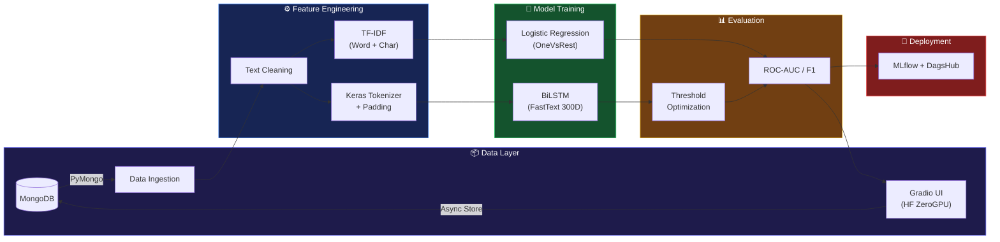
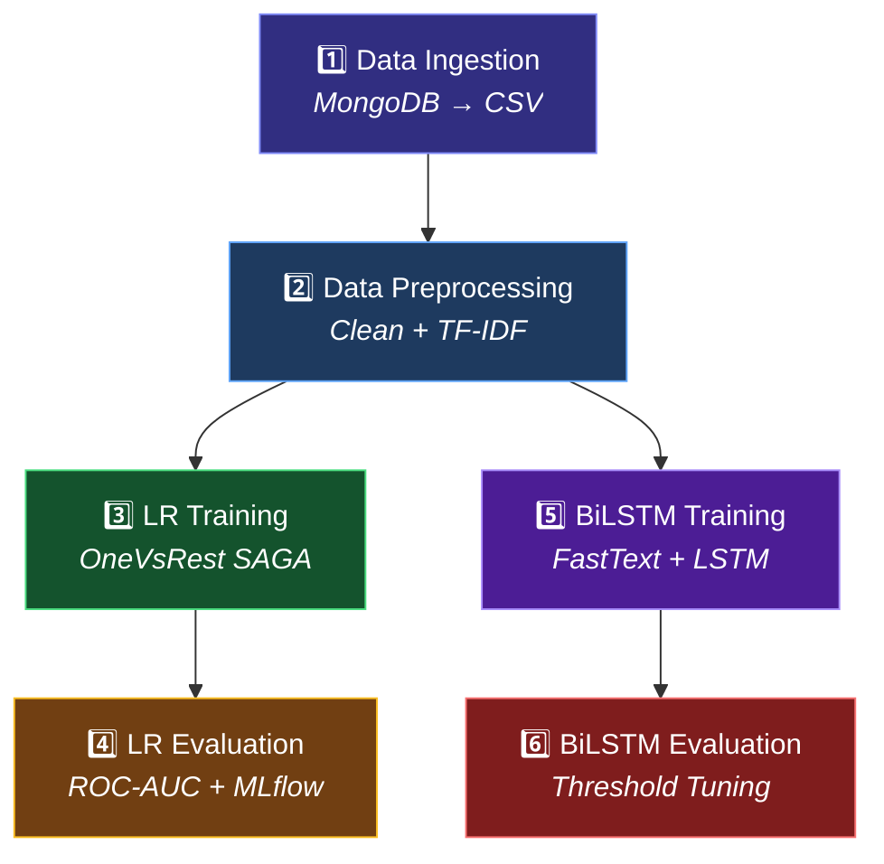

<div align="center">

# 🛡️ Toxic Comment Classifier

### *AI-Powered Real-Time Content Moderation*

<p>
  
</p>

<p>
  <a href="https://huggingface.co/spaces/YashAI07/Toxic-Comment-Classifier">
    
  </a>
  <a href="https://tinyurl.com/2c6bns36">
    
  </a>
  <a href="https://github.com/vyash0048-bit/Toxic-Comment-Classifier">
    
  </a>
</p>

<p>
  
  
  
  
  
  
  
</p>

<br/>

> Detect **toxic**, **obscene**, **threatening**, and **hateful** language in real-time  
> using a dual-model architecture powered by TF-IDF and FastText embeddings.

<br/>

---

</div>

## ⚡ Highlights

<table>
<tr>
<td width="50%">

### 🎯 Dual-Model Architecture
Choose between a blazing-fast **Logistic Regression** baseline or a deep **Bidirectional LSTM** model — both trained on 6 toxicity categories.

</td>
<td width="50%">

### 📊 97% Mean ROC-AUC
Industry-grade classification performance with per-label optimized decision thresholds and comprehensive evaluation metrics.

</td>
</tr>
<tr>
<td width="50%">

### 🔬 Advanced NLP Features
Dual TF-IDF (word + character n-grams) with 110K features and pre-trained FastText 300D embeddings for deep semantic understanding.

</td>
<td width="50%">

### 🚀 Production-Ready MLOps
End-to-end reproducible pipeline with DVC versioning, MLflow experiment tracking, Docker containerization, and Hugging Face deployment.

</td>
</tr>
</table>

<br/>

## 🏗️ System Architecture



<br/>

## 🧠 Models

<details open>
<summary><b>📈 Model 1 — Logistic Regression (Baseline)</b></summary>

<br/>

| Component | Detail |
|:--|:--|
| **Feature Extraction** | `FeatureUnion` of Word TF-IDF + Character TF-IDF |
| **Word TF-IDF** | N-grams `(1, 2)` · 50,000 features · Sublinear TF |
| **Char TF-IDF** | N-grams `(3, 5)` · 60,000 features · Sublinear TF |
| **Classifier** | `OneVsRestClassifier(LogisticRegression)` |
| **Solver** | SAGA · Regularization C=0.5 |
| **Total Features** | ~110,000 sparse dimensions |

</details>

<details open>
<summary><b>🧬 Model 2 — BiLSTM (Deep Learning)</b></summary>

<br/>

| Layer | Configuration |
|:--|:--|
| **Embedding** | FastText 300D · Vocab 20K · Non-trainable |
| **SpatialDropout1D** | Rate: 0.2 |
| **Bidirectional LSTM** | 128 units · Return sequences · Dropout 0.2 |
| **GlobalMaxPool1D** | Temporal max pooling |
| **Dense** | 64 units · ReLU activation |
| **Dropout** | Rate: 0.3 |
| **Output** | 6 units · Sigmoid (multi-label) |
| **Optimizer** | Adam · LR: 0.001 |
| **Callbacks** | ReduceLROnPlateau · EarlyStopping on `val_auc` |

</details>

<br/>

## 📊 Performance Comparison

<div align="center">

| Category | LR ROC-AUC | BiLSTM ROC-AUC | LR F1 | BiLSTM F1 |
|:--|:--:|:--:|:--:|:--:|
| 🔴 **Toxic** | 0.9427 | 0.9426 | 0.6613 | 0.6076 |
| 🟣 **Severe Toxic** | 0.9843 | **0.9860** | 0.3120 | **0.3524** |
| 🟠 **Obscene** | 0.9762 | 0.9744 | 0.6795 | **0.6799** |
| 🔵 **Threat** | **0.9893** | 0.9563 | **0.3765** | 0.1062 |
| 🟡 **Insult** | 0.9699 | 0.9666 | 0.5701 | **0.5925** |
| ⚫ **Identity Hate** | 0.9430 | 0.9214 | 0.3418 | **0.3758** |
| | | | | |
| 🏆 **Mean ROC-AUC** | **0.9676** | 0.9579 | — | — |

</div>

<br/>

## 🔄 ML Pipeline

The project uses **DVC** (Data Version Control) for a fully reproducible, 6-stage pipeline:



Run the full pipeline:
```bash
dvc repro
```

<br/>

## 🛠️ Tech Stack

<div align="center">

| Category | Technologies |
|:--|:--|
| **ML / DL** | Scikit-Learn · TensorFlow / Keras · Gensim |
| **NLP** | TF-IDF (Word + Char N-grams) · FastText 300D Embeddings |
| **Data** | MongoDB · Pandas · NumPy · SciPy Sparse |
| **Web** | Gradio |
| **MLOps** | DVC · MLflow · DagsHub |
| **Deployment** | Hugging Face Spaces (ZeroGPU) |
| **Monitoring** | Custom Logging · Async MongoDB Prediction Storage |

</div>

<br/>

## 🚀 Quick Start

### 1. Clone & Install

```bash
git clone https://github.com/vyash0048-bit/Toxic-Comment-Classifier.git
cd Toxic-Comment-Classifier
pip install -r requirements.txt
```

### 2. Set Environment Variables

```bash
# Create a .env file
MONGODB_URI=your_mongodb_connection_string
DATABASE_NAME=your_database
PREDICTION_COLLECTION=predictions
TRAIN_COLLECTION=train
TEST_COLLECTION=test
TEST_LABELS_COLLECTION=test_labels
MLFLOW_TRACKING_URI=https://dagshub.com/your_user/your_repo.mlflow
DAGSHUB_TOKEN=your_token
```

### 3. Run the Pipeline

```bash
# Full DVC pipeline
dvc repro

# Or run directly
python main.py
```

### 4. Launch the App

```bash
# Gradio UI with ZeroGPU support
python app.py
```

<br/>

## 📁 Project Structure

```
Toxic-Comment-Classifier/
├── 📄 app.py                    # Gradio web interface (HF Spaces)
├── 📄 flask_app.py              # Flask REST API + dashboard
├── 📄 main.py                   # Full training pipeline runner
├── 📄 Dockerfile                # Container deployment
├── 📄 dvc.yaml                  # DVC pipeline definition
├── 📄 params.yaml               # Hyperparameters config
│
├── 📂 src/ToxicCommentClassifier/
│   ├── 📂 components/           # Core ML components
│   │   ├── data_ingestion.py        # MongoDB data extraction
│   │   ├── data_preprocessing.py    # Text cleaning + TF-IDF
│   │   ├── model_training.py        # Logistic Regression
│   │   ├── model_evaluation.py      # LR metrics + MLflow
│   │   ├── bilstm_training.py       # BiLSTM + FastText
│   │   └── bilstm_evaluation.py     # BiLSTM metrics + thresholds
│   ├── 📂 pipeline/             # Pipeline orchestration
│   │   ├── prediction_pipeline.py   # Inference with lazy loading
│   │   └── stage_01..06_*.py        # Training stage runners
│   ├── 📂 config/               # Configuration management
│   └── 📂 entity/               # Data classes & schemas
│
├── 📂 artifacts/                # Model weights & processed data
├── 📂 config/                   # YAML configuration files
├── 📂 templates/                # Flask HTML dashboard
└── 📂 research/                 # Jupyter notebooks
```

<br/>


## 📜 License

This project is licensed under the **MIT License** — see the [LICENSE](LICENSE) file for details.

<br/>

<div align="center">

---

<p align="center">
  
</p>

<p>
  <a href="https://github.com/vyash0048-bit">
    
  </a>
</p>

</div>